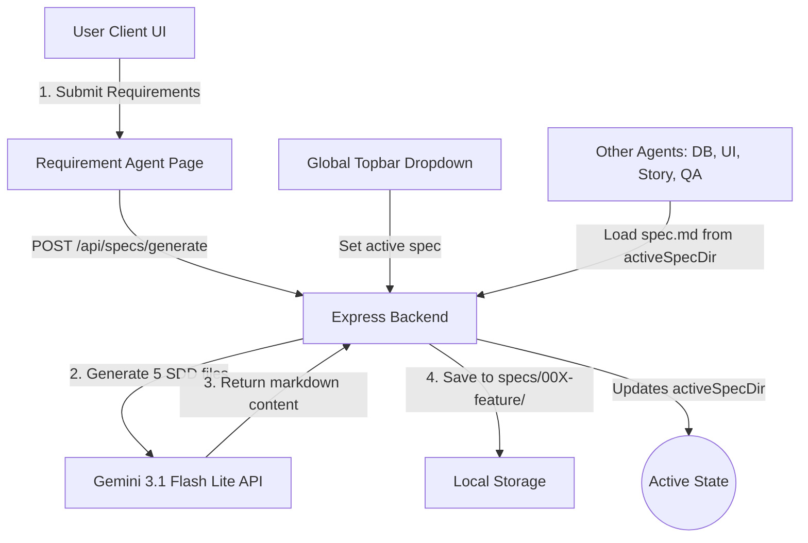

# Implementation Plan: Spec Kit Scaffolding (Requirement Agent) & Dynamic Spec Selection

This plan details the addition of a **Requirement Agent** as the first step of the SDD framework. It enables inputting raw requirements, executing Spec Kit `specify` prompts via Gemini to generate 5 project documents (`constitution.md`, `plan.md`, `spec.md`, `tasks.md`, `research.md`), storing them in a dedicated folder, and allowing dynamic spec selection across all agents.

---

## Proposed Architecture

---

## Proposed Changes

### 1. Backend Service: Spec Kit Scaffolder
* Create a backend utility `server/src/services/specKit.service.js` which:
  - Takes a raw requirement text (or file content).
  - Infers a clean directory slug (e.g. `002-user-registration`).
  - Sequentially requests Gemini `gemini-3.1-flash-lite` to generate:
    1. **`constitution.md`**: Project guidance, design guidelines, and tech stack boundaries.
    2. **`spec.md`**: Detailed system/feature specification sheet.
    3. **`plan.md`**: Step-by-step implementation plan.
    4. **`tasks.md`**: Ordered TODO backlog checklist.
    5. **`research.md`**: Technical architecture and stack research notes.
  - Creates a new directory `sdd-framework-org/specs/00X-feature/` and writes these 5 files.
  - Returns the list of files generated and automatically sets this feature as active.

### 2. Backend Routes
* Edit `server/src/index.queue.js` to:
  - Maintain a dynamic `activeSpecDir` state (defaulting to `001-return-request-tracker`).
  - Expose API routes:
    - `GET /api/specs/list` -> List all directory folders inside `specs/`.
    - `GET /api/specs/active` -> Get the current active spec name and files list.
    - `POST /api/specs/active` -> Switch the active spec folder.
    - `POST /api/specs/generate` -> Trigger the Spec Kit generation chain.
  - Update `getSpecFilePath()` to return the active folder path.
  - Ensure all other endpoints `/api/workspace/spec`, `/generate/:type`, etc. call `getSpecFilePath()` dynamically.

### 3. Frontend Pages & Components
* Create a new React view `RequirementAgent.jsx` in `framework/src/pages/`:
  - Provide a requirement text input and file upload panel.
  - Execute button that invokes `/api/specs/generate` with live console logger.
  - Post-generation viewer showing links and tabs to read the generated Spec Kit documents (`spec.md`, `constitution.md`, etc.).
* Edit `framework/src/main.jsx` to:
  - Add `Requirement Agent` to the top of `navigationItems` as the **first step in the framework**.
  - Replace the static "Selected Spec" text in the header with a **dynamic dropdown select menu** that lists all enqueued spec folders, allowing the user to change the active specification.

---

## Verification Plan

### Automated Verification
* Write a node script `server/src/scripts/test-speckit.js` to test generating files:
  1. Initialize connection.
  2. Parse a test requirement description.
  3. Verify a folder is created under `specs/` containing all 5 Spec Kit files.

### Manual Verification
1. Open the application. Go to **Requirement Agent**.
2. Type or upload a requirement (e.g. *"Implement an email notification system for tracking claims"*).
3. Click **Generate Scaffolding** and verify console log outputs.
4. Go to **Database Design** or **User Stories** and verify the context is loaded from the new specification.
5. Swap back to `001-return-request-tracker` via the header dropdown and check that the old spec loads.
