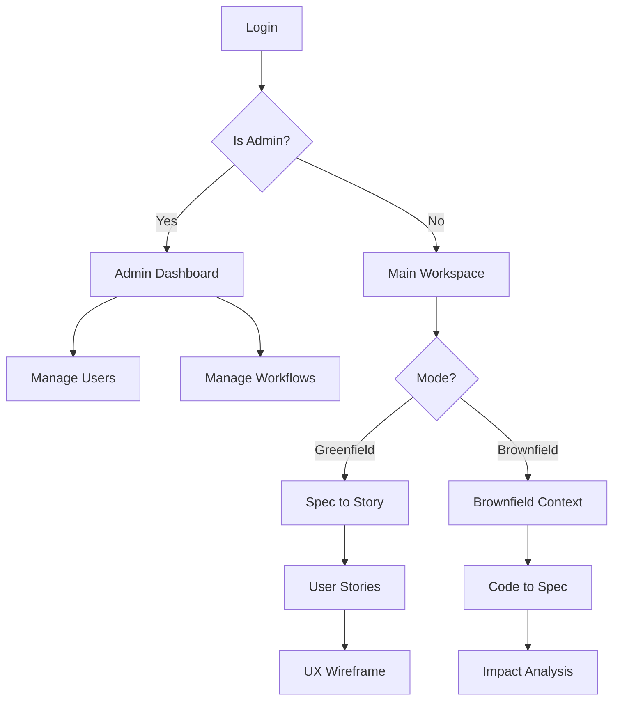

# Technical Product Requirements Document (PRD)
## Application: Frugal Forge (Intelligent Requirements Framework)

### 1. Overview
Frugal Forge (also known as SDD AI Studio) is a comprehensive React-based frontend application designed to manage, orchestrate, and validate software requirements, design specifications, and development workflows. It supports both "Greenfield" (new projects) and "Brownfield" (legacy migrations/modifications) modes. It includes an administrative dashboard, a role-based access control system (RBAC), and various "Agent" views for generating user stories, wireframes, architectures, and more.

### 2. Technology Stack
*   **Core:** React 18 (Vite bundler)
*   **Routing:** React Router v6
*   **Styling:** Tailwind CSS (Dark theme by default, with custom slate/indigo/amber palettes)
*   **Icons:** FontAwesome (v6 via CDN)
*   **Diagrams:** React Flow (`reactflow`) for visual workflow orchestration, Mermaid.js for embedded charts.
*   **State Management:** React Context API (e.g., `PageContext`) and `localStorage` for persistence (users, projects, workflows, active specs).

### 3. Core Architecture & Routing

#### Layout Structure
The application uses a persistent split-pane layout for the main workspace:
1.  **Sidebar (`<aside>`):** Contains brand header, collapsible navigation (dynamic based on RBAC), system status, API server connection (Port 7001), and sign-out logic.
2.  **Top Header (`<header>`):** Contains a Project Dropdown (select active project), Spec Dropdown, a Token Usage Badge, and a Theme Toggle (Dark/Light mode).
3.  **Main Content Area (`<main>`):** Renders the active route.

#### Key Routes
*   `/login`: Authentication page.
*   `/admin/*`: Admin dashboard and management pages (Users, Projects, Personas, Agents, Agent Mapping, Workflows, Debate Circles).
*   **Greenfield Agent Routes:**
    *   `/validator`: Live Debate Boardroom
    *   `/spec-to-story`: Spec to Story (Agile generation)
    *   `/user-stories`: User Stories backlog
    *   `/ux-wireframe`: UX Wireframe prototypes
    *   `/functional-spec`: Functional Spec (FSD)
    *   `/tech-architecture`: Tech Architecture blueprints
    *   `/database-design`: Database Design (ERD/DDL)
    *   `/test-cases`: Test Cases (QA/Gherkin)
    *   `/traceability-matrix`: Traceability Matrix
    *   `/review-agent`: Review Agent (Compliance/Scans)
*   **Brownfield Agent Routes:**
    *   `/brownfield-context`: Project Context (Code/DDL)
    *   `/code-to-spec`: Code to Spec reverse engineering
    *   `/impact-analysis`: Impact & Gap Specs

### 4. State & Data Models

#### The `PageContext`
Manages global UI state:
*   `projectMode`: String (`'greenfield'` | `'brownfield'`)
*   `pages`: Object tracking the state and generated outputs of various agents.

#### Local Storage Keys
*   `sdd_users`: Array of user objects `{ id, name, isSuperAdmin, projectAccess }`.
*   `sdd_projects`: Array of projects `{ name, type }`.
*   `activeProject`: Currently selected project.
*   `agentMappings`: Maps Personas to permitted Agents (`{ id, project, persona, agents: [] }`).
*   `sdd_project_workflows`: Defines Node/Edge workflows (React Flow data) for agent dependencies.
*   `theme`: `'dark'` | `'light'`.

### 5. UI/UX Design System

#### Color Palette (Tailwind)
*   **Backgrounds:** `#0b0f19` (sidebar/header), `#070a13` (main workspace).
*   **Accents:** Indigo (primary for Greenfield), Amber (primary for Brownfield).
*   **Text:** Slate colors (`text-slate-400`, `text-slate-500`) with white highlights for active states.

#### Typography
*   Primary Fonts: `Outfit` and `Plus Jakarta Sans` (Google Fonts).

#### Micro-Interactions
*   Hover states on sidebar items add subtle gradients (`bg-gradient-to-r`).
*   Active sidebar items feature a glowing border and distinct background (Indigo or Amber based on `projectMode`).
*   Pulsing indicator for API server connection.

### 6. Complex Features

#### Role-Based Navigation
Navigation is dynamic. If the user is a 'Super Admin', they see all routes. Otherwise, their navigation links are filtered based on the `agentMappings` from local storage.

#### Workflow Dependency Tracking
The application strictly enforces workflows. If an agent (e.g., UX Wireframe) requires input from a previous agent (e.g., User Stories) according to the `sdd_project_workflows` graph, and the previous agent hasn't generated output, a `MissingDependencyView` intercepts the route and prompts the user to complete the predecessor task first.

#### Token Management System
*   **HeaderTokenBadge:** Displays current token consumption.
*   **TokenThresholdAlert:** A global alert component that warns the user when nearing API rate limits or budget thresholds.
*   **TokenTrackerWidget:** A detailed modal showing token breakdown by agent/model.

### 7. Workflow Diagram

### 8. Implementation Instructions for LLM
When building this app from scratch based on this PRD:
1.  **Initialize:** Vite + React + TailwindCSS.
2.  **Styles:** Replicate the dark theme aesthetic meticulously. Use the exact background hex codes.
3.  **Routing:** Setup `react-router-dom` with the `Layout` wrapper protecting the agent routes.
4.  **Context:** Build a robust `PageContext` to handle `projectMode` toggling and state preservation.
5.  **Mock API:** Where `fetch('http://localhost:7001/api/...')` is defined, implement robust `try/catch` and fallback to `localStorage` if the server is unreachable.
