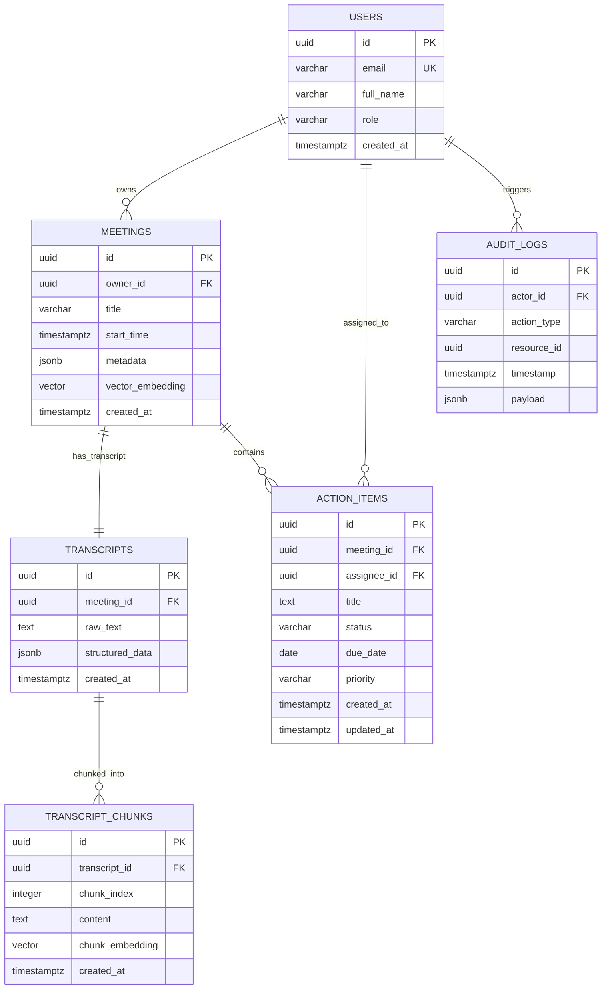

# Field Specifications Document

## Table: users
Stores details of the platform's system users with Role-Based Access Control (RBAC) constraints.

| Column Name | Data Type | Constraints | Description |
| :--- | :--- | :--- | :--- |
| `id` | `UUID` | `PRIMARY KEY`, `DEFAULT gen_random_uuid()` | Unique identifier for the user. |
| `email` | `VARCHAR(255)` | `NOT NULL`, `UNIQUE` | User email address used for login and notifications. |
| `full_name` | `VARCHAR(255)` | `NULL` | Full display name of the user. |
| `role` | `VARCHAR(20)` | `NOT NULL`, `CHECK (role IN ('Admin', 'Manager', 'Employee'))` | Used for system authorization (RBAC context). |
| `created_at` | `TIMESTAMP` | `DEFAULT CURRENT_TIMESTAMP` | Internal timestamp of the user creation. |

---

## Table: meetings
Represents a recorded business meeting, integrating calendar data and high-level structural parameters.

| Column Name | Data Type | Constraints | Description |
| :--- | :--- | :--- | :--- |
| `id` | `UUID` | `PRIMARY KEY`, `DEFAULT gen_random_uuid()` | Unique meeting identifier. |
| `owner_id` | `UUID` | `NOT NULL`, `REFERENCES users(id) ON DELETE CASCADE` | Meeting organizer/creator. |
| `title` | `VARCHAR(255)` | `NOT NULL` | The name or topic of the scheduled session. |
| `start_time` | `TIMESTAMP` | `NOT NULL` | Standardized execution start window. |
| `metadata` | `JSONB` | `DEFAULT '{}'::jsonb` | Extensible key-value store containing Jira references, tags, and execution environments. |
| `vector_embedding` | `VECTOR(1536)`| `NULL` | Global summary semantic vector representation for quick search extraction. |
| `created_at` | `TIMESTAMP` | `DEFAULT CURRENT_TIMESTAMP` | Internal system recording timestamp. |

---

## Table: transcripts
Stores Whisper ASR outputs mapping speaker interactions to timestamps.

| Column Name | Data Type | Constraints | Description |
| :--- | :--- | :--- | :--- |
| `id` | `UUID` | `PRIMARY KEY`, `DEFAULT gen_random_uuid()` | Unique system identifier for the text transcription. |
| `meeting_id` | `UUID` | `NOT NULL`, `UNIQUE`, `REFERENCES meetings(id) ON DELETE CASCADE` | Source meeting context link (1-to-1). |
| `raw_text` | `TEXT` | `NOT NULL` | The complete text content of the dialogue transcription. |
| `structured_data` | `JSONB` | `NOT NULL` | Timestamps, word sequences, speaker identification hashes, and confidence metrics. |
| `created_at` | `TIMESTAMP` | `DEFAULT CURRENT_TIMESTAMP` | Platform ingestion execution timestamp. |

---

## Table: transcript_chunks
Used for high-granularity vector search retrieval within long-running audio files (RAG system architecture).

| Column Name | Data Type | Constraints | Description |
| :--- | :--- | :--- | :--- |
| `id` | `UUID` | `PRIMARY KEY` | Segment identifier database index. |
| `transcript_id`| `UUID` | `NOT NULL`, `REFERENCES transcripts(id) ON DELETE CASCADE` | Associated meeting transcript lookup path. |
| `chunk_index` | `INTEGER` | `NOT NULL` | Chronological sort order of the parsed paragraph chunk. |
| `content` | `TEXT` | `NOT NULL` | Text content of the single conversation block or excerpt. |
| `chunk_embedding`| `VECTOR(1536)`| `NOT NULL` | Vector representation calculated for the RAG search matches. |
| `created_at` | `TIMESTAMP` | `DEFAULT CURRENT_TIMESTAMP` | Creation date. |

---

## Table: action_items
Action tracking assignments mapped directly to context domains.

| Column Name | Data Type | Constraints | Description |
| :--- | :--- | :--- | :--- |
| `id` | `UUID` | `PRIMARY KEY` | Action key reference ID. |
| `meeting_id` | `UUID` | `NOT NULL`, `REFERENCES meetings(id) ON DELETE CASCADE` | Meeting link from which the item was extracted. |
| `assignee_id` | `UUID` | `NULL`, `REFERENCES users(id) ON DELETE SET NULL` | Linked responsible operator. |
| `title` | `TEXT` | `NOT NULL` | Expected performance delivery outcome description. |
| `status` | `VARCHAR(20)` | `NOT NULL`, `CHECK (status IN ('Open', 'In Progress', 'Blocked', 'Completed', 'Cancelled'))` | Lifecyle processing step identifier. |
| `due_date` | `DATE` | `NULL` | Agreed target execution schedule boundary. |
| `priority` | `VARCHAR(10)` | `NOT NULL`, `CHECK (priority IN ('Critical', 'High', 'Medium', 'Low'))` | Project execution severity index. |
| `created_at` | `TIMESTAMP` | `DEFAULT CURRENT_TIMESTAMP` | System assignment timestamp. |
| `updated_at` | `TIMESTAMP` | `DEFAULT CURRENT_TIMESTAMP` | Status and assignment state modification log. |

---

## Table: audit_logs
Compliance storage tracker tracking historical configuration transformations.

| Column Name | Data Type | Constraints | Description |
| :--- | :--- | :--- | :--- |
| `id` | `UUID` | `PRIMARY KEY` | Audit log record identity. |
| `actor_id` | `UUID` | `NULL`, `REFERENCES users(id) ON DELETE SET NULL` | Performing operator responsible for the event. |
| `action_type` | `VARCHAR(100)`| `NOT NULL` | Described change class (e.g. update, deletion, read). |
| `resource_id` | `UUID` | `NOT NULL` | ID target of the mutated record context. |
| `timestamp` | `TIMESTAMP` | `DEFAULT CURRENT_TIMESTAMP` | Log record capture datetime. |
| `payload` | `JSONB` | `NULL` | Complete transaction history payload details. |

## SQL DDL Schema

```sql
CREATE EXTENSION IF NOT EXISTS "uuid-ossp";
CREATE EXTENSION IF NOT EXISTS vector;

-- 1. Users Table (Core identity & RBAC model)
CREATE TABLE users (
    id UUID PRIMARY KEY DEFAULT uuid_generate_v4(),
    email VARCHAR(255) UNIQUE NOT NULL,
    full_name VARCHAR(255),
    role VARCHAR(20) NOT NULL CHECK (role IN ('Admin', 'Manager', 'Employee')),
    created_at TIMESTAMP WITH TIME ZONE DEFAULT CURRENT_TIMESTAMP
);

-- 2. Meetings Table (Metadata & High-Level Embedding)
CREATE TABLE meetings (
    id UUID PRIMARY KEY DEFAULT uuid_generate_v4(),
    owner_id UUID NOT NULL REFERENCES users(id) ON DELETE CASCADE,
    title VARCHAR(255) NOT NULL,
    start_time TIMESTAMP WITH TIME ZONE NOT NULL,
    metadata JSONB DEFAULT '{}'::jsonb, -- Stores context tags, department, external platform links (e.g. Jira/DevOps ID)
    vector_embedding VECTOR(1536), -- Document-level embedding for global semantic search
    created_at TIMESTAMP WITH TIME ZONE DEFAULT CURRENT_TIMESTAMP
);

-- 3. Transcripts Table (Whisper Raw Text & Structured JSON Outputs)
CREATE TABLE transcripts (
    id UUID PRIMARY KEY DEFAULT uuid_generate_v4(),
    meeting_id UUID NOT NULL UNIQUE REFERENCES meetings(id) ON DELETE CASCADE,
    raw_text TEXT NOT NULL,
    structured_data JSONB NOT NULL, -- Speaker timelines, timestamps, raw Whisper payload
    created_at TIMESTAMP WITH TIME ZONE DEFAULT CURRENT_TIMESTAMP
);

-- 4. Transcript Chunks Table (Granular RAG / Semantic Search)
CREATE TABLE transcript_chunks (
    id UUID PRIMARY KEY DEFAULT uuid_generate_v4(),
    transcript_id UUID NOT NULL REFERENCES transcripts(id) ON DELETE CASCADE,
    chunk_index INT NOT NULL,
    content TEXT NOT NULL,
    chunk_embedding VECTOR(1536), -- Vector embeddings (OpenAI 1536 dimensions) for semantic retrieval
    created_at TIMESTAMP WITH TIME ZONE DEFAULT CURRENT_TIMESTAMP
);

-- 5. Action Items Table (Extracted Deliverables)
CREATE TABLE action_items (
    id UUID PRIMARY KEY DEFAULT uuid_generate_v4(),
    meeting_id UUID NOT NULL REFERENCES meetings(id) ON DELETE CASCADE,
    assignee_id UUID REFERENCES users(id) ON DELETE SET NULL, -- Default NULL if unassigned
    title TEXT NOT NULL,
    status VARCHAR(20) NOT NULL CHECK (status IN ('Open', 'In Progress', 'Blocked', 'Completed', 'Cancelled')),
    due_date DATE,
    priority VARCHAR(10) NOT NULL CHECK (priority IN ('Critical', 'High', 'Medium', 'Low')),
    created_at TIMESTAMP WITH TIME ZONE DEFAULT CURRENT_TIMESTAMP,
    updated_at TIMESTAMP WITH TIME ZONE DEFAULT CURRENT_TIMESTAMP
);

-- 6. Audit Logs Table (Regulatory & Compliance Security Mandate)
CREATE TABLE audit_logs (
    id UUID PRIMARY KEY DEFAULT uuid_generate_v4(),
    actor_id UUID REFERENCES users(id) ON DELETE SET NULL,
    action_type VARCHAR(100) NOT NULL, -- e.g., 'MEETING_SUMMARY_GENERATED', 'ACTION_ITEM_STATUS_UPDATED'
    resource_id UUID NOT NULL, -- General target entity reference
    timestamp TIMESTAMP WITH TIME ZONE DEFAULT CURRENT_TIMESTAMP,
    payload JSONB -- Snapshot of changes or state metadata (AES-256 encrypted at rest inside enterprise storage volumes)
);

-- Indexes for Performance & Semantic Optimization
CREATE INDEX idx_meetings_owner_id ON meetings(owner_id);
CREATE INDEX idx_meetings_metadata ON meetings USING gin(metadata);
CREATE INDEX idx_action_items_meeting_id ON action_items(meeting_id);
CREATE INDEX idx_action_items_assignee_id ON action_items(assignee_id);
CREATE INDEX idx_audit_logs_actor_id ON audit_logs(actor_id);
CREATE INDEX idx_transcript_chunks_id ON transcript_chunks(transcript_id);

-- HNSW Vector Indexing for Semantic Search Performance
CREATE INDEX idx_meetings_vector ON meetings USING hnsw (vector_embedding vector_cosine_ops);
CREATE INDEX idx_chunks_vector ON transcript_chunks USING hnsw (chunk_embedding vector_cosine_ops);
```


## Mermaid ERD


