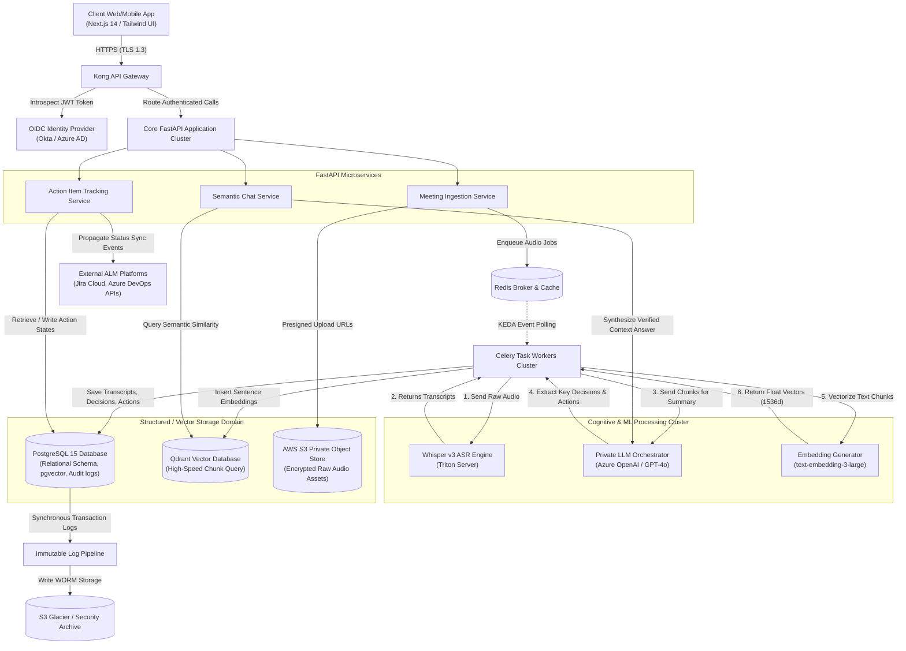

# Technical Architecture Document: Intelligent Meeting & Action Management Platform

## 1. Executive Summary & Goals

### 1.1 Context & Problem Statement
Enterprise environments are saturated with recurring status meetings, strategic alignments, and cross-functional planning sessions. However, the operational value of these discussions is frequently lost due to fragmented manual note-taking, delayed synthesis, and lack of accountability for action items. This leads to a systematic breakdown in execution, alignment gaps across organizational layers, and a massive expenditure of high-cost human capital on low-value documentation overhead.

### 1.2 Mission & Primary Objectives
The Intelligent Meeting & Action Management Platform addresses these inefficiencies by transforming unstructured verbal interactions into structured, auditable, and actionable business intelligence. Leveraging enterprise-grade Automatic Speech Recognition (ASR), Retrieval-Augmented Generation (RAG), and deterministic orchestration pipelines, the platform acts as the organizational system of record for decisions and commitments.

*   **90% Reduction in Manual Documentation Overhead:** Automating transcription, summary generation, and semantic tagging, returning thousands of hours of high-value focus time to leadership and execution teams.
*   **Centralized Decision Repository:** Providing semantic, cross-meeting discovery of historical context, context-aware RAG querying, and organizational alignment continuity.
*   **80% System-Wide Action Item Closure Rate Increase:** Enforcing automated extraction, mapping target owners, continuous status tracking, and seamless synchronization with existing application life-cycle management (ALM) engines (such as Jira, Azure DevOps, and Linear).

### 1.3 Key Architectural Indicators (KPIs)
*   **Availability:** 99.9% uptime for core API and data-retrieval engines.
*   **Performance (P95 Latencies):**
    *   Query Semantic Search Response: < 150ms
    *   Interactive Chat Response (First Token): < 200ms
    *   Ingestion to Summary Availability: Less than 1.5x the audio duration (e.g., a 60-minute meeting is processed, transcripted, summarized, and semantic-indexed in under 90 seconds).
*   **Precision/Recall metrics:** > 95% precision on AI-extracted Action Item attribution (`owner`, `due_date`, `priority`).

---

## 2. Tech Stack Selection & Justification

```
+-----------------------------------------------------------------------------------------+
|                                    USER INTERFACE                                       |
|                Next.js 14 (App Router) | React | Tailwind CSS | Radix UI                |
+-----------------------------------------------------------------------------------------+
                                             |
                                             v
+-----------------------------------------------------------------------------------------+
|                                 API GATEWAY / INGRESS                                   |
|                         Kong API Gateway (OIDC, Rate-Limiting, TLS 1.3)                 |
+-----------------------------------------------------------------------------------------+
                                             |
                        +--------------------+--------------------+
                        |                                         |
                        v                                         v
+-----------------------------------------------+ +---------------------------------------+
|             CORE APPLICATION LAYER            | |            COMPUTE ENGINE             |
|  FastAPI (Python 3.11)                        | |  Celery Distributed Task Workers      |
|  - Async processing, native Pydantic typing   | |  - High-throughput ingestion queues   |
|  - Direct integration with ML toolchains      | |  - Auto-scaling based on queue depth  |
+-----------------------------------------------+ +---------------------------------------+
        |                      |                                  |
        | Relational Data      | Vetor Indexing                   | File Storage
        v                      v                                  v
+-----------------------+ +---------------------+ +---------------------------------------+
|     DATA STORE        | |     VECTOR DB       | |            OBJECT STORE               |
| PostgreSQL 15         | | Qdrant Cloud        | | AWS S3 / Azure Blob Storage           |
| - pgvector extension  | | - Ultra-low latency | | - SSE-S3 AES-256                      |
| - Partitioned tables  | | - Sparse/Dense      | | - Custom presigned URLs for upload    |
+-----------------------+ +---------------------+ +---------------------------------------+
                               |                                  |
                               v                                  v
+-----------------------------------------------------------------------------------------+
|                               AI & COGNITIVE WORKLOADS                                  |
|        ASR Pipeline: OpenAI Whisper Large v3 (Self-Hosted via Triton Inference Server)   |
|        LLM Core Orchestration: OpenAI GPT-4o (VPC-peered endpoints) / Claude 3.5 Sonnet  |
|        Embedding Models: text-embedding-3-large (1536 dimensions)                       |
+-----------------------------------------------------------------------------------------+
```

### 2.1 Backend Framework
*   **Technology Selection:** **FastAPI (Python 3.11+)**
*   **Justification:** FastAPI provides asynchronous request handling natively, enabling high concurrency handling for long-lived operations (such as streaming LLM tokens, processing WebSockets for transcription notifications, and orchestrating downstream analytics integrations). Its seamless integration with the Python ML ecosystem (LangChain, LlamaIndex, NumPy, PyTorch) eliminates data-serialization overhead between the server layer and local machine-learning toolchains.

### 2.2 Relational and Transactional Database
*   **Technology Selection:** **PostgreSQL 15+** (with **pgvector** enabled)
*   **Justification:** Relational integrity is paramount for strict security controls, billing, user schemas, and transactional states of Action Items. The pgvector extension is utilized for direct query indexing of high-level meeting properties, allowing transactional consistency and basic semantic search to occur in a single engine. PostgreSQL's robust JSONB indexing support is critical for schema-less custom payload mapping with external integration partners (such as Jira issue custom fields).

### 2.3 Vector Database
*   **Technology Selection:** **Qdrant (Distributed Cluster)**
*   **Justification:** While PostgreSQL with `pgvector` handles relational-adjacent vector operations, enterprise-grade semantic search over deep hierarchies of transcripts requires specialized architecture. Qdrant delivers ultra-low latency sub-10ms search over billions of vectors, native support for payload filtering (allowing multi-tenant isolation directly at the indexing layer), and HNSW index structures optimized for massive dynamic updates without degrading query latency.

### 2.4 Distributed Task & Queue Management
*   **Technology Selection:** **Celery with Redis (as Broker/Cache)**
*   **Justification:** Processing meeting audio is compute-heavy and highly variable. Offloading file processing, ASR diarization, and structural generation pipelines to Celery ensures the API Gateway remains completely responsive. Celery's canvas workflows allow the orchestrator to compose complex, multi-stage pipelines (e.g., Chunk Audio -> Parallel Transcribe -> Merge Transcripts -> Generate Summaries -> Index Vectors -> Alert Integrations) with robust retry mechanisms, error handling, and dead-letter queues.

### 2.5 Machine Learning & LLM Core Services
*   **Audio Transcription (ASR):** **Whisper API** (using self-hosted **Whisper-Large-v3** on NVIDIA Triton Inference Servers for VPC-peered deployments to guarantee zero third-party data retention).
*   **Context Summary & Action Extraction:** **OpenAI GPT-4o** via Azure OpenAI (private endpoints to ensure data residency and no public model training access).
*   **Semantic Embeddings:** **text-embedding-3-large** (dimension size: `1536`) config for uniform text semantic representations across deep vector layers.

---

## 3. Integration & API Contracts

### 3.1 Architecture Overview
All API endpoints enforce strict token-based authorization via JWT (derived from OIDC providers). Operations are divided into Synchronous REST interactions for metadata discovery, and Asynchronous Jobs for heavy processing pipelines.

### 3.2 Endpoint Specifications

#### 3.2.1 POST /api/v1/meetings/summary
Trigger automated pipeline processing on an existing meeting record. If audio chunking is still occurring, this endpoint starts a tracking orchestrator job state.

*   **Headers:**
    *   `Authorization: Bearer <JWT_TOKEN>`
    *   `Content-Type: application/json`
    *   `X-Correlation-ID: UUIDv4` (Used for end-to-end tracing across distributed microservices)

*   **Request Schema:**
```json
{
  "meeting_id": "3fa85f64-5717-4562-b3fc-2c963f66afa6",
  "model": "gpt-4o",
  "temperature": 0.1,
  "language_hint": "en",
  "custom_prompts": {
    "focus_areas": "Focus heavily on compliance, architectural decisions, and software delivery timelines."
  }
}
```

*   **Response Schema (Success - HTTP 202 Accepted):**
```json
{
  "task_id": "9b1deb4d-3b7d-4bad-9bdd-2b0d7b3dcb6d",
  "meeting_id": "3fa85f64-5717-4562-b3fc-2c963f66afa6",
  "status": "processing",
  "estimated_completion_time": "2023-10-27T10:15:30Z",
  "_links": {
    "status_url": "/api/v1/tasks/9b1deb4d-3b7d-4bad-9bdd-2b0d7b3dcb6d",
    "meeting_url": "/api/v1/meetings/3fa85f64-5717-4562-b3fc-2c963f66afa6"
  }
}
```

*   **Response Schema (Success - HTTP 200 OK, if already cached and processed):**
```json
{
  "meeting_id": "3fa85f64-5717-4562-b3fc-2c963f66afa6",
  "summary": "The architecture team reviewed migration paths from localized pgvector instances to Qdrant Cloud. Major decisions center on optimizing latency and securing multi-tenant operations.",
  "key_decisions": [
    {
      "decision_id": "dec-001",
      "title": "Migrate to Qdrant Cloud",
      "context": "Need sub-10ms query performance for vector similarity queries over 100M document vectors.",
      "approved_by": ["4a529321-dfdf-45fc-ae6b-0294103ab630"]
    }
  ],
  "action_items": [
    {
      "id": "act-771",
      "title": "Provision test Qdrant Cluster and configure tenant payload indexing.",
      "owner_id": "4a529321-dfdf-45fc-ae6b-0294103ab630",
      "due_date": "2023-11-05",
      "priority": "High",
      "status": "Open"
    }
  ]
}
```

*   **Error Response (HTTP 422 Unprocessable Entity - Invalid Input Schema):**
```json
{
  "error_code": "VAL_SCHEMA_FAILED",
  "message": "Validation error on input properties.",
  "details": [
    {
      "loc": ["body", "model"],
      "msg": "value is not a valid enumeration member; permitted: 'gpt-4o', 'claude-3-5-sonnet'",
      "type": "type_error.enum"
    }
  ],
  "timestamp": "2023-10-27T10:14:02Z"
}
```

#### 3.2.2 GET /api/v1/actions
Retrieves a list of Action Items across visible workspace scopes based on permissions derived from JWT.

*   **Headers:**
    *   `Authorization: Bearer <JWT_TOKEN>`

*   **Query Parameters:**
    *   `status`: String (Optional. Filters by state: `Open`, `In Progress`, `Blocked`, `Completed`, `Cancelled`)
    *   `priority`: String (Optional. Filters by level: `Critical`, `High`, `Medium`, `Low`)
    *   `owner_id`: UUID (Optional. Filters items assigned to specific identifier)
    *   `limit`: Integer (Default: 20, Max: 100)
    *   `offset`: Integer (Default: 0)

*   **Response Schema (Success - HTTP 200 OK):**
```json
{
  "actions": [
    {
      "id": "act-771",
      "meeting_id": "3fa85f64-5717-4562-b3fc-2c963f66afa6",
      "title": "Provision test Qdrant Cluster and configure tenant payload indexing.",
      "owner_id": "4a529321-dfdf-45fc-ae6b-0294103ab630",
      "due_date": "2023-11-05",
      "priority": "High",
      "status": "Open",
      "created_at": "2023-10-27T10:14:00Z",
      "updated_at": "2023-10-27T10:14:00Z"
    }
  ],
  "pagination": {
    "total_records": 142,
    "limit": 1,
    "offset": 0,
    "has_more": true
  }
}
```

---

## 4. Data Model & Storage Design

### 4.1 Schema Definition (DDL)
Below is the complete database structure containing all base elements, performance keys, strict constraint rules, data types, indexes, and partition schemes.

```sql
-- Enable Extensions needed for security and Vector Math
CREATE EXTENSION IF NOT EXISTS "uuid-ossp";
CREATE EXTENSION IF NOT EXISTS "vector"; -- pgvector for relational vector indexes

-- Create Global User Schema
CREATE TABLE users (
    id UUID PRIMARY KEY DEFAULT uuid_generate_v4(),
    email VARCHAR(255) UNIQUE NOT NULL,
    full_name VARCHAR(128) NOT NULL,
    role VARCHAR(50) NOT NULL CHECK (role IN ('Admin', 'Manager', 'Employee')),
    created_at TIMESTAMP WITH TIME ZONE DEFAULT CURRENT_TIMESTAMP NOT NULL,
    updated_at TIMESTAMP WITH TIME ZONE DEFAULT CURRENT_TIMESTAMP NOT NULL
);-- Index email for login lookup operations
CREATE INDEX idx_users_email ON users(email);

-- Create Core Meetings Table with Vector Integration capabilities
CREATE TABLE meetings (
    id UUID PRIMARY KEY DEFAULT uuid_generate_v4(),
    owner_id UUID NOT NULL REFERENCES users(id) ON DELETE CASCADE,
    title VARCHAR(255) NOT NULL,
    start_time TIMESTAMP WITH TIME ZONE NOT NULL,
    end_time TIMESTAMP WITH TIME ZONE,
    metadata JSONB DEFAULT '{}'::jsonb NOT NULL, -- Stores tags, meeting origin, external systems integration tracking
    vector_embedding VECTOR(1536), -- Represents high-level summary concept index
    created_at TIMESTAMP WITH TIME ZONE DEFAULT CURRENT_TIMESTAMP NOT NULL,
    updated_at TIMESTAMP WITH TIME ZONE DEFAULT CURRENT_TIMESTAMP NOT NULL
);

-- Create Performance GIN Index for arbitrary metadata querying
CREATE INDEX idx_meetings_metadata_gin ON meetings USING gin (metadata);
-- GIST or HNSW index on the vector embedding column (pgvector)
CREATE INDEX idx_meetings_vector_hnsw ON meetings USING hnsw (vector_embedding vector_cosine_ops);

-- Create Core Action Items Table
CREATE TABLE action_items (
    id UUID PRIMARY KEY DEFAULT uuid_generate_v4(),
    meeting_id UUID NOT NULL REFERENCES meetings(id) ON DELETE CASCADE,
    owner_id UUID NOT NULL REFERENCES users(id) ON DELETE RESTRICT,
    title TEXT NOT NULL,
    description TEXT,
    status VARCHAR(20) NOT NULL CHECK (status IN ('Open', 'In Progress', 'Blocked', 'Completed', 'Cancelled')) DEFAULT 'Open',
    due_date DATE,
    priority VARCHAR(10) NOT NULL CHECK (priority IN ('Critical', 'High', 'Medium', 'Low')) DEFAULT 'Medium',
    created_at TIMESTAMP WITH TIME ZONE DEFAULT CURRENT_TIMESTAMP NOT NULL,
    updated_at TIMESTAMP WITH TIME ZONE DEFAULT CURRENT_TIMESTAMP NOT NULL
);

-- Fast search indexes for workflow tracking dashboard updates
CREATE INDEX idx_action_items_meeting ON action_items(meeting_id);
CREATE INDEX idx_action_items_owner ON action_items(owner_id);
CREATE INDEX idx_action_items_status ON action_items(status);
CREATE INDEX idx_action_items_due_date ON action_items(due_date);

-- Create System Audit Logging Table
CREATE TABLE audit_logs (
    id UUID PRIMARY KEY DEFAULT uuid_generate_v4(),
    actor_id UUID NOT NULL REFERENCES users(id) ON DELETE RESTRICT,
    action_type VARCHAR(64) NOT NULL, -- 'meeting.created', 'action_item.updated', 'vector.queried'
    resource_id UUID NOT NULL, -- Target entity ID
    details JSONB NOT NULL,
    ip_address VARCHAR(45) NOT NULL,
    user_agent TEXT NOT NULL,
    timestamp TIMESTAMP WITH TIME ZONE DEFAULT CURRENT_TIMESTAMP NOT NULL
);
-- Index for fast security review audits
CREATE INDEX idx_audit_logs_actor_time ON audit_logs(actor_id, timestamp DESC);
CREATE INDEX idx_audit_logs_resource ON audit_logs(resource_id);
```

### 4.2 Relational vs. Document vs. Vector Database Boundaries
To maintain structured consistency and sub-10ms scalability, data is distributed across dynamic stores with precise replication/sync patterns:

```
+-----------------------------------------------------------------------------------------+
|                                 DATA DISTRIBUTION MATRIX                                |
+-----------------------------------------------------------------------------------------+
|        POSTGRESQL (Relational)         |                 QDRANT (Vector)                |
|                                        |                                                |
|  - Master Transactional Record         |  - Sentence / Excerpt Embeddings               |
|  - Strict Foreign Key integrity        |  - Sparse Keyword matching alongside Dense     |
|  - Multi-tenant Organization boundaries|  - Target payload metadata (tenant_id)         |
|  - Audit trail history state           |  - Low latency retrieval of context blocks     |
+-----------------------------------------------------------------------------------------+
```

1.  **PostgreSQL (Relational):** Acts as the Source of Truth for system structures, user identity roles, meeting metadata, explicit relationships, task tracking configurations, and logs.
2.  **Qdrant (Vector Engine):** Houses granular chunked transcripts. The transcript of an individual meeting is split into overlapping chunks (e.g., 500 characters, 100 character overlap), embedded using `text-embedding-3-large`, and ingested into Qdrant alongside strict key-value payloads (`meeting_id`, `tenant_id`, `owner_id`). Qdrant handles dynamic similarity queries and hybrid semantic keyword searching.

---

## 5. Security, Compliance & Data Residency

```
                         +-----------------------------+
                         |   OIDC Provider (Okta/AD)   |
                         +-----------------------------+
                                        |
                       Exchange JWT     |  Return Claims
                       & User Identity  |  & Group Membership
                                        v
+------------------+     Tokens         +-----------------------------+
|   Client App     |------------------->|      Kong API Gateway       |
+------------------+                    +-----------------------------+
                                                    | Validate JWT & Signatures
                                                    v
                                        +-----------------------------+
                                        |      Application Layer      |
                                        |  - Enforce Dynamic RBAC     |
                                        |  - Query Audit Log Service  |
                                        +-----------------------------+
```

### 5.1 Identity and Access Management (IAM)
*   **OIDC and SAML Core Integration:** Enterprise directory sync is handled exclusively via OpenID Connect (OIDC) or SAML 2.0. No localized passwords are created or stored on the system database. The application layer consumes signed JWT payloads originating from certified identity provider suites (such as Azure Active Directory, Ping Identity, Okta).
*   **Role-Based Access Control (RBAC):** Every application pathway is intercepted by a declarative access middleware checker that evaluates incoming JWT scope claims. 

| System Role | Permissions |
| :--- | :--- |
| **Admin** | Full system administration, billing access, audit log downloads, deletion of any workspace, model parameters adjustment, custom system integration configurations. |
| **Manager** | Read and write access to linked teams, upload/ingest audio files, trigger summaries, assign action items to any team member, and run semantic queries. |
| **Employee** | Read access to meeting metadata, transcript outlines, and summaries shared with them. Write access is restricted solely to updating status states on explicitly assigned Action Items. |

### 5.2 Cryptographic Standard Execution
*   **Data-in-Transit Encryption:** Handled uniformly via **TLS 1.3** across all ingress endpoints, terminating directly at the API Gateway layer. Internally within the cluster boundary, service-to-service communication employs Mutual TLS (mTLS) brokered by an Istio Service Mesh, preventing packet sniffing across internal microservice topologies.
*   **Data-at-Rest Encryption:** Primary database systems, document stores, and cache files are encrypted at the block layer with **AES-256** using customer-managed keys (CMK) rotated annually via cloud KMS vaults (AWS KMS or Azure Key Vault).

### 5.3 Audit Trails
Any operation that alters database data models (e.g., changing status on actions, deleting recordings, modifying scopes) must trigger synchronous database writes to the immutable `audit_logs` table before returns can resolve to client calls. These log tables are partitioned monthly and auto-replicated to write-once-read-many (WORM) storage vaults with a mandatory 7-year retention constraint.

### 5.4 Data Residency and Cloud Deployment Models
*   **Local VPC Ingress Isolation:** Organizations utilizing highly regulated data schemas deploy the service using container orchestration engines (AWS EKS or Azure AKS) with a fully private network pattern.
*   **No Data Exfiltration Commitments:** No data is stored, buffered, or sent outside the corporate private tenant bounds. LLM capabilities are bound to local instances of models, or dedicated private endpoints configured without external fine-tuning capabilities. For instances utilizing external model endpoints, Azure Open AI Private Endpoints are mapped via Virtual Network Peering.

---

## 6. Resilience, Scalability & Failover Rules

```
                                    [ Audio Ingest Inbound ]
                                               |
                                               v
                                   +-----------------------+
                                   |   Ingress Gateway     |
                                   +-----------------------+
                                               |
                   +---------------------------+---------------------------+
                   |                                                       |
                   v                                                       v
     +---------------------------+                           +---------------------------+
     |     Primary API Pod       |                           |    Secondary Failover     |
     |  (Scale limits: HPA >70%) |                           |     Kubernetes Replica    |
     +---------------------------+                           +---------------------------+
                   |
                   v
     +---------------------------+
     |  Redis Queue Broker Cluster|
     +---------------------------+
                   |                                            & Retry Queue (Expo Backoff)
                   +--------------------------------------------------------+
                   |                                                        |
                   v                                                        v
     +---------------------------+                           +---------------------------+
     |   Celery Processing Pod   |                           |    Retry Queue Consumer   |
     |  (Dynamic Worker Scaling) |                           |  (Out of bounds processing)|
     +---------------------------+                           +---------------------------+
                   |                                                        |
        +----------+----------+                                             |
        |                     |                                             |
        v                     v                                             v
+---------------+     +---------------+                             +---------------+ 
| PostgreSQL    |     |  Primary LLM  |--(On 429 Rate Limit Errors)-|
| Replication   |     |    Gateway    |                             |  Secondary LLM|
| Active-Active |     +---------------+                             |   Fallback    |
+---------------+                                                   +---------------+
```

### 6.1 Autoscaling Strategies
*   **Application Gateway Ingress:** Scaled horizontally using Kubernetes Horizontal Pod Autoscalers (HPA) targeting standard metrics (Memory target >70%, CPU utilization target >80%).
*   **Async Processing Workers (Celery):** Scaled dynamically via KEDA (Kubernetes Event-driven Autoscaling) using the queue depth in Redis as the primary metric. As the volume of pending audio files increases, KEDA spins up additional ephemeral Celery runtime pods equipped to consume files, dropping down to zero active execution units once system queues run clear.

### 6.2 Circuit Breakers and Fallbacks
All integration pathways with third-party components (such as OpenAI/Anthropic APIs, Jira, or Outlook) are protected by a stateful circuit breaker pattern implemented via Resilience4j or standard Python wrappers.

```
                      +----------------------------------------+
                      |          Invoke External API           |
                      +----------------------------------------+
                                           |
                         +-----------------+-----------------+
                         | Success                           | Fails
                         v                                   v
             +-----------------------+           +-----------------------+
             |  Complete Processing  |           | Increment Fail Count  |
             +-----------------------+           +-----------------------+
                                                             |
                                           +-----------------+-----------------+
                                           | Fail Count < Threshold            | Fail Count > Threshold
                                           v                                   v
                                 +-------------------+               +-------------------+
                                 | Retry with        |               |   Circuit Opens   |
                                 | Exponential       |               | (Block Outbound)  |
                                 | Backoff Delay     |               +-------------------+
                                 +-------------------+                         |
                                                                               v
                                                                     +-------------------+
                                                                     | Divert to Local   |
                                                                     | Fallback Model /  |
                                                                     | Graceful Error    |
                                                                     +-------------------+
```

*   **Whisper & LLM Provider Call Resilience:** If Azure OpenAI rate limits are triggered (HTTP 429), the gateway handles automatic failovers down to secondary cluster endpoints, or drops down to lower tier context execution paths (e.g., shifting dynamically from GPT-4o to Mixtral-8x7B running inside the private enterprise container cluster).
*   **Exponential Backoff Retries:** All API interactions that experience transient failures (network drops, connection failures) are automatically retried up to 5 times. The delay interval increases exponentially using random jitter: 
    $$\text{Delay} = 2^{\text{attempt}} + \text{jitter}$$

### 6.3 Disaster Recovery and Replication Policies
*   **PostgreSQL Databases:** Configure Active-Active replication between two target geographic regions using automated read replica promotion if primary regional connection issues occur.
*   **RPO (Recovery Point Objective):** Restricted to under 1 minute using continuous transaction log archiving (WAL-G to secure storage tiers).
*   **RTO (Recovery Time Objective):** Automated multi-region DNS failover ensures fully active service endpoints are back online globally inside 3 minutes during absolute regional cloud failures.

## Mermaid Architecture Diagram


